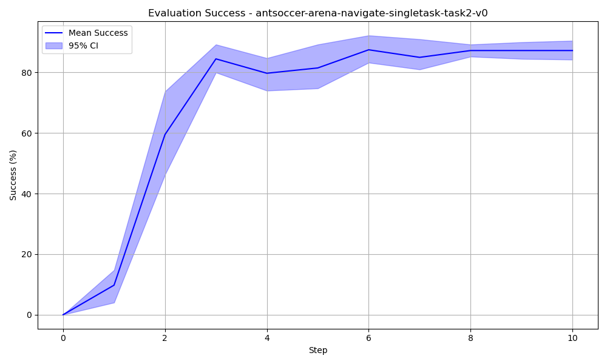
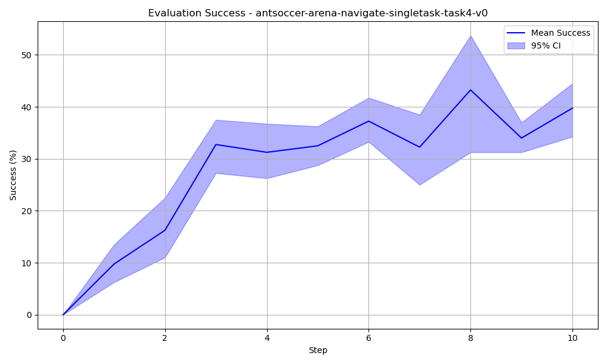

# Report

## Milestone 0: Setup and Reproduce Results

@MazenAmria and @Mohamed-Hatem-Ibrahim tried running the project locally and installing the dependencies.

@MazenAmria automated the installation process with a KISLURM script.

@Mouafak-Khaled prepared scripts to run the reproducing jobs on KISLURM.

All team members spend time reading the paper, looking at the code, getting familiar with KISLURM, and setting up all the required dependencies to be prepared for the next milestones.

### Results

We reproduced the results of two tasks:

- `antsoccer-arena-navigate-singletask-task2-v0`
- `antsoccer-arena-navigate-singletask-task4-v0`

We followed the original paper's evaluation method, by fixing the same hyperparameters and evaluating over 8 different seeds. We got results similar to the original paper, as they got $88 \pm 3$ and $39 \pm 6$, and we got $87.25 \pm 4.68$ an d $39.75 \pm 7.45$ for both tasks respectively.

